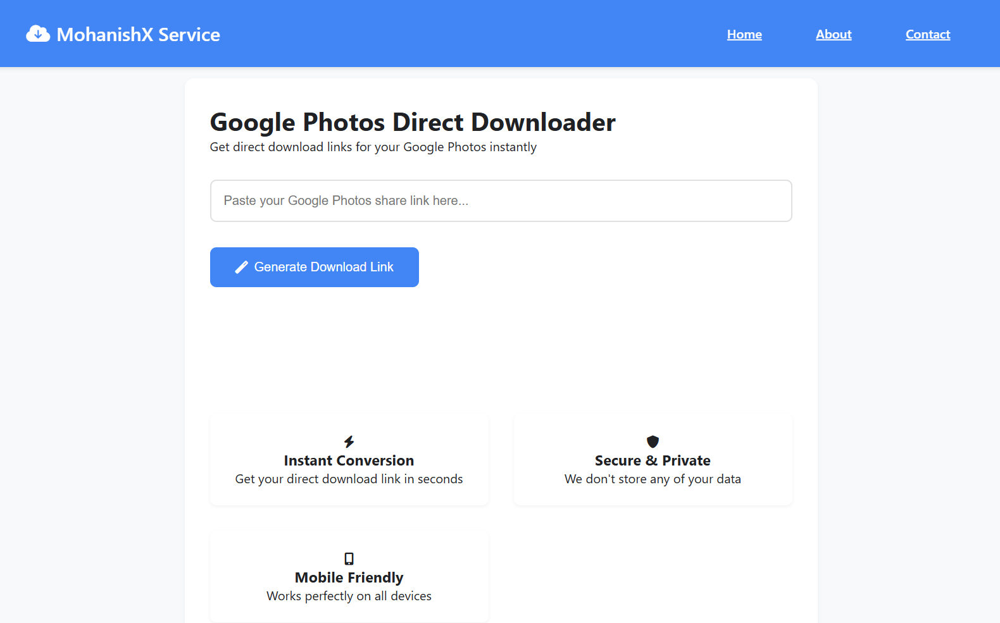

# 📸 Google Photos Direct Link Generator

Generate **direct download links** from Google Photos share URLs using a **serverless reverse proxy** powered by **Cloudflare Workers**.

🔗 [Live Demo](https://cdn-s1.mohanishx1.workers.dev/)

---

## 🚀 Features
- ✅ Convert Google Photos share links into **direct download links**  
- ✅ Works with both **images & videos**  
- ✅ Secure: no data stored  
- ✅ Simple web UI + API endpoint  
- ✅ Mobile-friendly design  

## 📂 Repository Structure

```
google-photos-direct-link
│── worker.js        # Your Cloudflare Worker code (the script you pasted)
│── README.md        # Documentation
│── LICENSE          # (optional) Choose MIT, Apache, etc.
```

---


## 🛠️ How It Works
1. Paste a **Google Photos share link** into the input box  
2. The Worker fetches the content & extracts the **direct Googleusercontent.com URL**  
3. A proxy download link is generated:  
```

https\://<your-worker-url>.workers.dev/download/<encoded-path>

````

---

## 📦 Deployment

### 1. Clone Repo
```bash
git clone https://github.com/Mohanish7777777/google-photos-direct-link-generator.git
cd google-photos-direct-link-generator
````

### 2. Deploy to Cloudflare Workers

If you don’t have Wrangler yet:

```bash
npm install -g wrangler
```

Login:

```bash
wrangler login
```

Publish:

```bash
wrangler publish worker.js
```

---

## 🖥️ API Usage

**Endpoint:**
`POST /api`

**Request Body:**

```json
{ "url": "https://photos.app.goo.gl/your-share-link" }
```

**Response:**

```json
{ "proxy_link": "/download/ENCODED_LINK" }
```

---

## 🌐 Frontend

The project also includes a clean **HTML/CSS/JS frontend** with:

* Navbar
* Input box for Google Photos link
* Result display with download & copy options

Preview:


---

## ⚖️ License

MIT License © 2025 \Mohanish K

### Contact 📧 mail@mohanish.in
